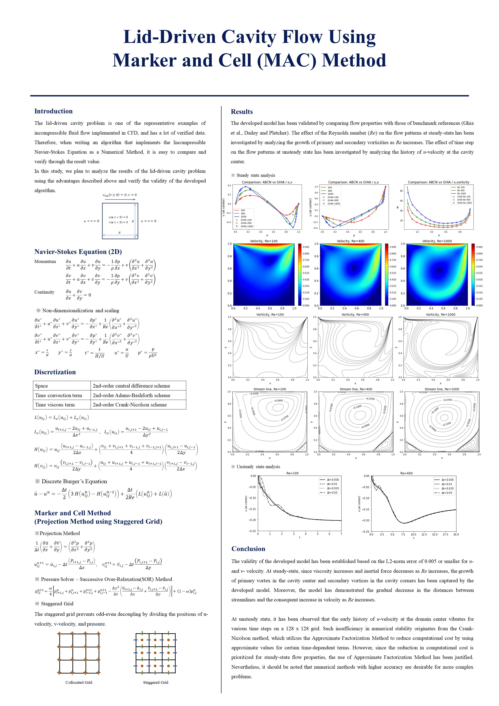

# CFD-Project

### Report

### Flow-Chart

### Code
1. Initial Definition

2. Set Boundary Conditions

3. Predict Intermediate Velocity

4. Compute The Pressure

5. Correct The Velocity

6. Plot Image

7. Operation
